# LiquidPad x402 examples

Pay-per-request examples for LiquidPad's agent-payable read endpoints.



Each script makes a real x402 call against `liquidpad.site` using USDC on Base
mainnet. Cold call returns HTTP 402 with payment requirements; signed retry
gets the data plus a settlement tx hash.

## What's exposed

| Endpoint | Price | What it returns |
|---|---|---|
| `GET /api/x402/verify/{address}` | $0.001 USDC | LiquidPad provenance for a token (verified, name, symbol, deployer, kind, ERC-8004 agent id) |
| `GET /api/x402/provenance/{address}` | $0.001 USDC | Full ERC-8004 provenance: agent id, identity registry, fee split, agent profile link |
| `GET /api/x402/agents?limit=N` | $0.005 USDC | Registry snapshot: every wallet that has shipped via Liquid Protocol on Base, with deploy counts and verification status |

All three have free counterparts at the same paths without `/x402/`. The paid
versions are for agents that need guaranteed access without sharing the public
rate budget.

There's also a pay-per-inference endpoint:

| Endpoint | Price | What it returns |
|---|---|---|
| `POST /api/x402/inference` | $0.01 USDC | A single OpenAI-compatible chat completion — no API key, output capped at 512 tokens |

Spec: <https://docs.x402.org/core-concepts/http-402>
Live page: <https://www.liquidpad.site/x402>

## Quick start (no payment, just see the 402)

```bash
curl -i https://www.liquidpad.site/api/x402/verify/0x188177dF522f81A9bEd88D25d1969A0B700b50E0
```

Returns `HTTP/2 402` with a JSON body listing the accepted payment scheme,
network, asset, amount, and operator wallet.

## Run a paying example

You need:
- Node 18+
- A funded EVM wallet with USDC on Base mainnet
- The wallet's private key in an env var

```bash
git clone https://github.com/liquidpadbot/liquidpad-x402-examples.git
cd liquidpad-x402-examples
npm install
export PRIVATE_KEY=0xyour_funded_key_with_a_few_cents_of_usdc
npm run verify -- 0x188177dF522f81A9bEd88D25d1969A0B700b50E0
```

You'll see:
1. Cold request → 402 with payment requirements
2. Wallet signs an EIP-3009 `transferWithAuthorization`
3. Retry with `X-PAYMENT` header → 200 with the verify result
4. Settlement tx hash printed

Cost per script run: $0.001 (verify, provenance) or $0.005 (agents).

## Examples in this repo

- [`verify.mjs`](./verify.mjs) — token provenance check
- [`provenance.mjs`](./provenance.mjs) — full ERC-8004 provenance
- [`agents.mjs`](./agents.mjs) — bulk read of the agents registry
- [`inference.mjs`](./inference.mjs) — pay-per-inference, OpenAI-compatible completion
- [`raw-curl.sh`](./raw-curl.sh) — cold-call snapshot, no signing (just see the 402)

## How it works

1. Client makes an unauthenticated request to a `/api/x402/*` endpoint
2. Server returns `HTTP 402` with a JSON body conforming to the
   [x402 protocol](https://docs.x402.org/core-concepts/http-402)
3. Client signs an EIP-3009 `transferWithAuthorization` (USDC's built-in
   gasless authorization mechanism — no on-chain approval round-trip)
4. Client base64-encodes the signed payload and retries with `X-PAYMENT` set
5. Server forwards to a facilitator (Coinbase CDP by default), which verifies
   the signature and settles on-chain
6. Server returns `200` with the data and an `X-PAYMENT-RESPONSE` header

The server is stateless. The facilitator handles verification, double-spend
protection, and on-chain settlement.

## Why pay when there are free endpoints?

The free endpoints are public-good infrastructure — rate-limited and shared
across all callers. The paid versions:

- Return the same data shape
- Don't share rate budget with anyone else
- Come with a settlement receipt (on-chain proof you paid)
- Can be chained agent-to-agent without sharing API keys

For exploratory or low-volume use, stay free. For production agent traffic,
pay.

## Operator wallet

Settlements route to `0x188177dF522f81A9bEd88D25d1969A0B700b50E0` on Base
mainnet. This is the LiquidPad operator wallet.

## License

MIT.
